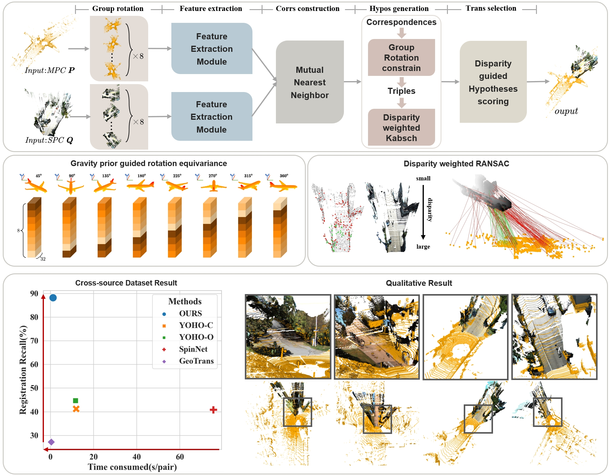

## A novel method for registration of MLS and stereo reconstructed point clouds

In this paper, we present a new algorithm for cross-source point cloud registration between MLS point clouds and stereo-reconstructed point clouds. 
To improve the registration performance in this task, our method has two key designs. Firstly, gravity prior is utilized to highlight features in specific directions to narrow the matching pair search and enhance the robustness and efficiency of rotation-equivariant descriptor construction. Secondly, to adapt to noise patterns of stereo-reconstructed point clouds, a novel disparity-weighted hypothesis scoring strategy is proposed to strengthen RANSAC-based transformation estimation. 
We create two new cross-source point cloud registration datasets to evaluate cross-source registration algorithms. The proposed method achieves state-of-the-art performance with a $43.5\%$ higher registration recall on cross-source datasets and a $10\times \sim 70\times$ speedup faster than RANSAC-based baselines. 



## Requirements

Here we offer the FCGF backbone YOHO. Thus FCGF requirements need to be met:

- Ubuntu 14.04 or higher
- CUDA 11.1 or higher
- Python v3.7 or higher
- Pytorch v1.6 or higher
- [MinkowskiEngine](https://github.com/stanfordvl/MinkowskiEngine) v0.5 or higher

Specifically, The code has been tested with:

- Ubuntu 20.04, CUDA 11.1, python 3.7.10, Pytorch 1.7.1, GeForce RTX 3080Ti.

## Installation

- First, create the conda environment:

  ```
  conda create -n msreg python=3.7
  conda activate msreg
  ```

- Second, intall Pytorch. We have checked version 1.7.1 and other versions can be referred to [Official Set](https://pytorch.org/get-started/previous-versions/).

  ```
  conda install pytorch==1.7.1 torchvision==0.8.2 torchaudio==0.7.2 cudatoolkit=11.1 -c pytorch
  ```

- Third, install MinkowskiEngine for FCGF feature extraction:

  ```
  git clone https://github.com/NVIDIA/MinkowskiEngine.git
  cd MinkowskiEngine
  conda install openblas-devel -c anaconda
  export CUDA_HOME=/usr/local/cuda-11.1
  python setup.py install --blas_include_dirs=${CONDA_PREFIX}/include --blas=openblas
  cd ..
  ```

  Or following official command installation:

  ```
  https://github.com/NVIDIA/MinkowskiEngine.git
  ```

- Fourth, install other packages:

  ```
  pip install -r requirements.txt
  ```

- Finally, compile the [CUDA based KNN searcher](https://github.com/vincentfpgarcia/kNN-CUDA):
  ```
  cd knn_search/
  export CUDA_HOME=/usr/local/cuda-11.1
  python setup.py build_ext --inplace
  cd ..
  ```

## Dataset & Pretrained model

The datasets and pretrained weights have been uploaded to Google Cloud:

For training:
- [KITTI_train]( );

For testing:
- [CTCS](https://drive.google.com/file/d/1EH6BFVfkvTD29i2-MNrZSELCDBzxCBv1/view?usp=drive_link);
- [CS](https://drive.google.com/file/d/1EH6BFVfkvTD29i2-MNrZSELCDBzxCBv1/view?usp=drive_link);

Pretained model:
- [Pretrained Weights](https://drive.google.com/file/d/1AbAQVI58WXtNN_xouKcPFunaV_iT94Yr/view?usp=drive_link ). 


Datasets above contain the point clouds (.ply) and keypoints (.txt, 5000 per point cloud) files. Please place the data to `./data/origin_data` following the example data structure as:

```
data/
├── origin_data/
    ├── kitti_train/
    	└── 0/
            ├── PointCloud/
            	├── cloud_bin_0.ply
            	├── ..
            	└── gt.log
            └── Keypoints/
            	└── cloud_bin_0Keypoints.txt
    ├── CS/
    └── CTCS/
```

Pretrained weights we offer include FCGF Backbone and msreg trained model. Which have been added to the main branch and organized following the structure as:

```
model/
├── Backbone/
	└── best_bal_checkpoint.pth
├── train/
	└── model_best.pth
```

## Train

To train MSReg, the group input of train set should be prepared using the FCGF model we offer, which is retrained with our data enhancement, sepcifically, for pc0 and pc1: 1.ground truth alignment 2.add the same group element rotation; for pc1: add a random rotation of 45°. 

```
python trainset.py
```

Then, you can train MSReg by the commands:

```
python Train.py
```

## Test on kitti

- Prepare the testset:
  ```
  python testset.py --dataset kitti_test
  ```
- Evaluate the results:
  ```
  python Test.py --max_iter 1000 --dataset kitti --ransac_d 0.5 --tau 2
  ```

## Generalize to the CTCS and CS

To evalute the generalization results of MSReg on CTCS and CS:

- Prepare the testset:
  ```
  python testset.py --dataset CTCS
  python testset.py --dataset CS
  ```
- Evaluate the results:
  ```
  python Test.py --max_iter 1000 --dataset CTCS --ransac_d 1.5 --tau 2 
  python Test.py --max_iter 1000 --dataset CS --ransac_d 1.5 --tau 2 
  ```


## Related Projects

We sincerely thank the excellent projects:

- [EMVN](http://github.com/daniilidis-group/emvn) for the group details;
- [FCGF](https://github.com/chrischoy/FCGF) for the backbone;
- [YOHO](https://github.com/HpWang-whu/YOHO) for the backbone;
- [Lac-GwcNet](https://github.com/SpadeLiu/Lac-GwcNet) for the stereo method;
- [KITTI](https://www.cvlibs.net/datasets/kitti/) for the KITTI dataset;
- [KITTI-360](https://www.cvlibs.net/datasets/kitti-360/) for the KITTI-360 dataset;
- [Predator](https://github.com/overlappredator/OverlapPredator) for the 3DLoMatch dataset;
